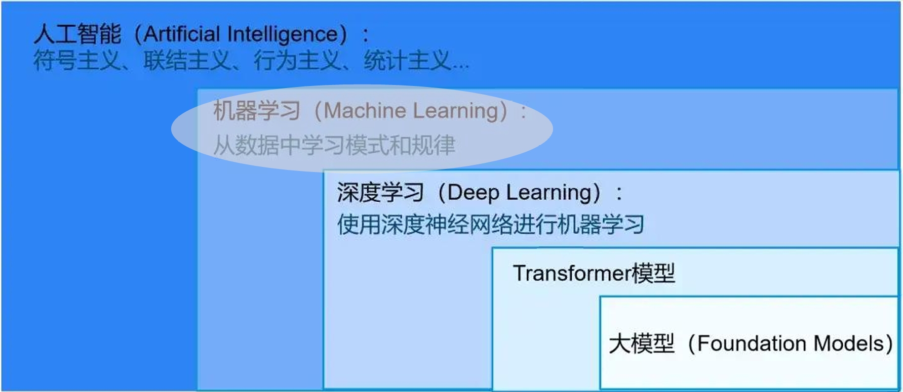

# AI 概述



## 模型组成	

​		我们平时所说的大模型，主要构成有三个部分：模型架构、配置信息以及权重参数。为了方便理解，可以类比于汽车：

**模型架构：**模型架构就类似于汽车的种类，是小轿车、SUV还是跑车、越野，不同的车型都有其独特的设计和用途；同理，不同的神经网络架构也适用于不同类型的任务。例如：

- 多层感知机（MLP）：适合基本的分类任务
- 卷积神经网络（CNN）：擅长处理图像数据
- 递归神经网络（RNN）或长短时记忆网络（LSTM）：专为序列化数据设计
- Transformer：适用于各种复杂的自然语言处理任务

**配置文件：**配置文件就像确定了汽车的类型后，具体这款车的详细规格，如车轮大小、车身长度及发动机排量等；同理，即使选择了某种模型架构，不同型号之间依旧存在差异，这些配置会影响模型的复杂度、计算成本以及最终的表现。如：

- 对于 Transformer 模型而言，隐藏层的数量、注意力头的数量、前馈神经网络的维度等参数

**权重：**权重就像是各个厂家对同一款车型的不同调校，使得地盘更稳定、悬挂系统更舒适、动力响应更快等，从而让车子在对于的场景中表现出更好的性能；同理，即使是相同的模型和相同的配置，不同的权重导致模型有不同的表现。如：

- 两个基于相同 Transformer 架构的模型，使用不同的预训练权重，它们在文本生成、翻译会问答等任务上表现可能会有显著差异。

## 模型生命周期【后面充分了解后进行建模】

​		我们继续用汽车来比喻模型从开发到预训练、微调、测试、发布、共享、部署和维护，每个阶段在做些什么。

**模型开发：**设计或制造一辆全新的概念车

**预训练：**对新车进行广泛的试驾和调校，在各种情况下测试其性能

**微调：**针对特定客户需求定制车辆，如增加安全特性或豪华配置

**测试：**新车上市前的严格质量检测，确保按预期工作

**发布：**正式推出某款汽车，进入市场销售

**共享：**开办车展或在线平台展示新款汽车

**部署：**新车交付给客户，开始日常使用

**维护：**定义保养和服务车辆，确保其长期保持良好的运行状态

# Transformer 库

​		`HunggingFace` 的 `Transformer` 库包含了大量的模型架构，同时提供了丰富的 API 来简化和扩展模型的使用。这些 API 可以大致分为几类：模型加载、数据处理、推理预测、训练与微调以及一些辅助工具。

## 模型架构

​		当用户安装 `Transformer` 库的时候，模型架构就已经以 Python 包的形式保存在本地环境中了。模型架构是以 Python 源代码（.py）文件的形式保存的，每个模型类（如`BertModel`、`T5ForConditionalGeneration`等）都有对应的Python文件，这些文件包含了模型架构的定义。

## 配置文件和权重

​		虽然模型架构是随库一起安装的，但**配置文件和预训练权重并不会自动下载**。它们只有在你首次使用`from_pretrained()`方法加载特定模型时才会被下载，并且会被缓存到一个特定的目录中，通常是：`~/.cache/huggingface/transformers/`（Linux/macOS）或`%APPDATA%\Hugging Face\transformers\`（Windows）。在这个缓存目录中，可以找到各个模型的配置文件（JSON格式）和预训练权重文件（通常为`.bin`或`.pt`格式）。这些文件会在未来的请求中直接从本地加载，以避免重复下载。

## from_pretrained() 方法

​		当使用 `from_pretrained()` 方法加载模型时，配置文件和预训练权重通常是从 Hugging Face的模型仓库[Model Hub](https://huggingface.co/models) 下载的。通常配置文件是 JSON 格式，包含了模型的超参数[^1]和其他设置。如下：

```json
{
  "_name_or_path": "microsoft/phi-4",	// 模型的名称和路径
  "architectures": [
    "Phi3ForCausalLM"					// 模型的类名
  ],
  "attention_bias": false,
  "attention_dropout": 0.0,
  "auto_map": {},
  "bos_token_id": 100257,
  "embd_pdrop": 0.0,
  "eos_token_id": 100257,
  "hidden_act": "silu",
  "hidden_size": 5120,              // 隐藏层维度大小，决定每一层神经元的数量
  "initializer_range": 0.02,		// 权重初始化的标准差，较小的值有助于防止梯度消失或爆炸问题
  "intermediate_size": 17920,		// 前馈神经网络中间层的尺寸
  "max_position_embeddings": 16384,	// 最大位置嵌入数，限制了模型可以处理的最大序列长度
  "model_type": "phi3",				// 模型类型标识符
  "num_attention_heads": 40,		// 多注意力头的数量
  "num_hidden_layers": 40,			// 隐藏层的数量
  "num_key_value_heads": 10,		// 用于稀疏注意力机制中的键值对头数
  "original_max_position_embeddings": 16384,
  "pad_token_id": 100257,
  "resid_pdrop": 0.0,
  "rms_norm_eps": 1e-05,
  "rope_scaling": null,
  "rope_theta": 250000,
  "sliding_window": null,
  "tie_word_embeddings": false,
  "torch_dtype": "bfloat16",
  "transformers_version": "4.47.0",
  "use_cache": true,
  "vocab_size": 100352				// 词汇表大小，表示模型支持的唯一 token 数量
}
```

​		预训练权重则取决于使用的框架，可以是 `PyTorch` 或 `TensorFlow` 格式

- PyTorch：一般为二进制文件，扩展名为 `.bin` 或

[^1]: 在机器学习和深度学习中，**超参数（Hyperparameters）**是指那些在模型训练开始之前需要设置的参数，它们不是通过训练数据直接学习到的，而是由用户或自动化工具选择和调整的，如隐藏层的数量及其大小、学习率、最大迭代次数等。超参数对模型的性能有着重要影响，因为它们控制着模型的学习过程和结构。