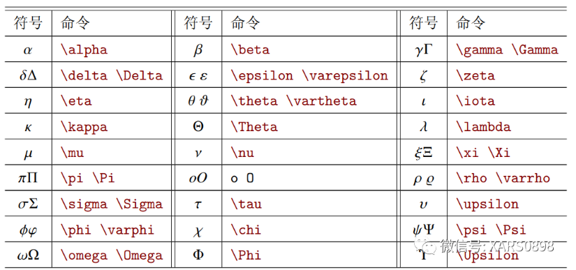
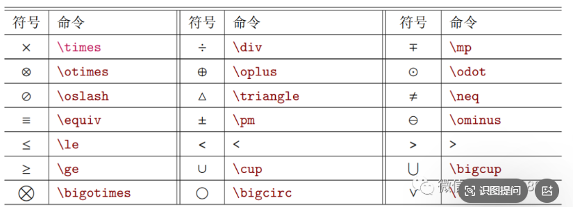
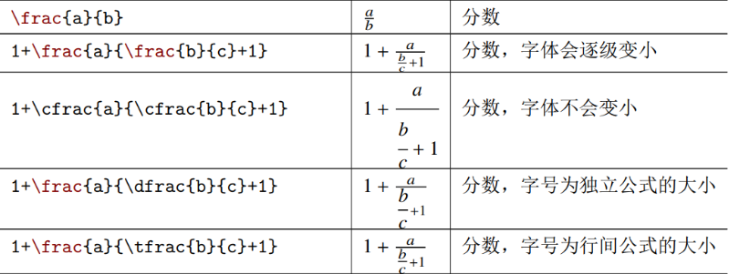
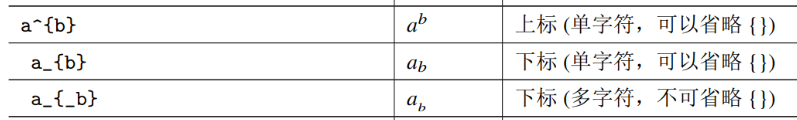
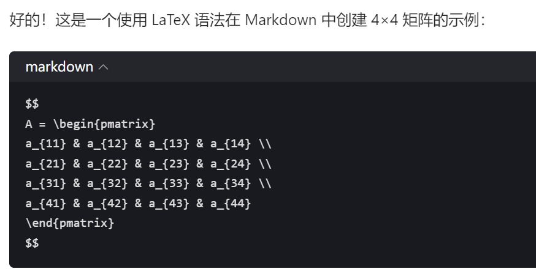
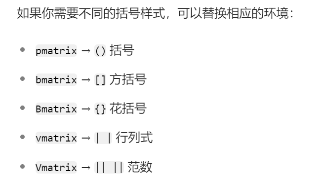

# LaTex使用说明

## 常见的数学符号

[常见的数学符号网页](https://zhuanlan.zhihu.com/p/464237097)





## 常见的命令

### 分数



### 上下标



## 矩阵





```latex
$$
A = \begin{bmatrix}
1 & 2 & 3 & 4 \\
5 & 6 & 7 & 8 \\
9 & 10 & 11 & 12 \\
13 & 14 & 15 & 16
\end{bmatrix}
$$
```

