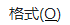

# Typora使用说明

## 1.设置标题

ctrl +1 一级标题

ctrl +2 二级标题

> 以此类推，最多只有6级标题
>


## 2.字体颜色


## 3.插入图片


## 4.引用

\> 空格 一级标题

\>> 空格 二级标题

## 5.字体大小


## 6.列表

6.1无序列表      ctrl+shift+] 

6.2有序列表      ctrl+shift+[ 


## 7.插入代码

7.1插入不确定变成语言代码  ctrl+shift+K

7.2插入确定变成语言代码

 开头```+语言名，然后回车键


## 8.插入表格

ctrl +T


## 9.插入公式

$$，然后回车键，出现一个公式框，可以用LaTex语法输入公式


## 10.超链接

格式选项里


## 11.脚注

格式选项里


